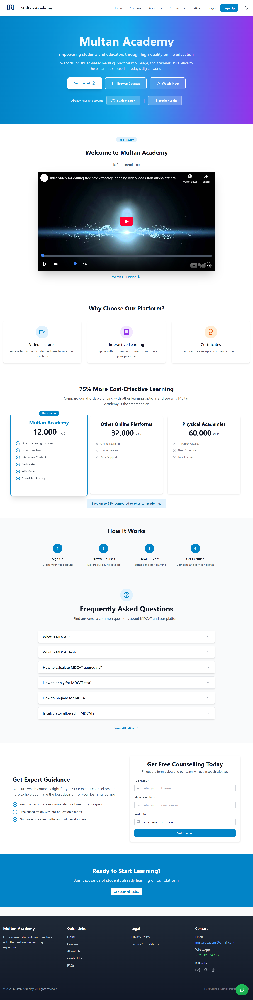
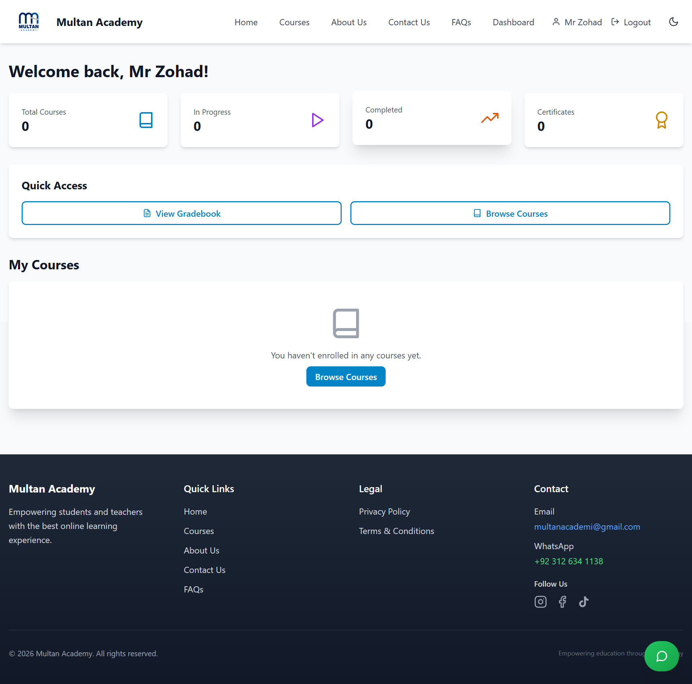
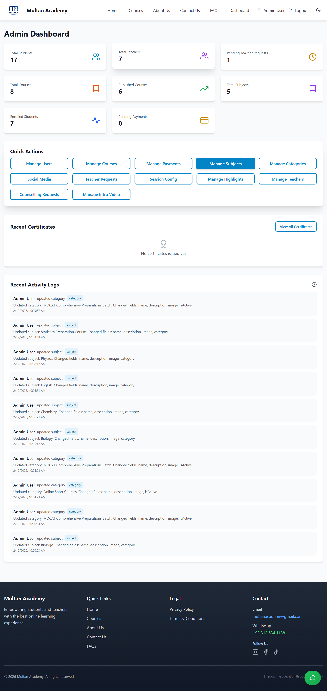
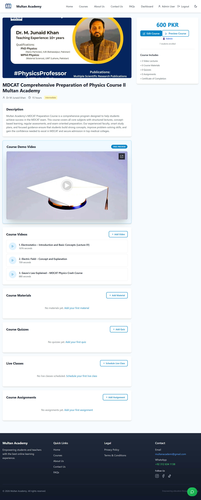
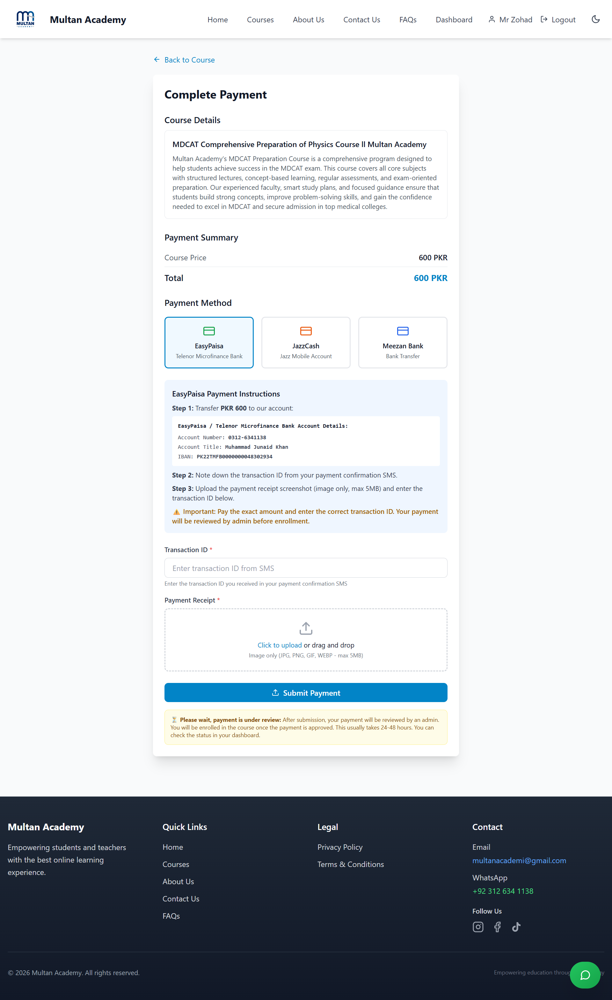
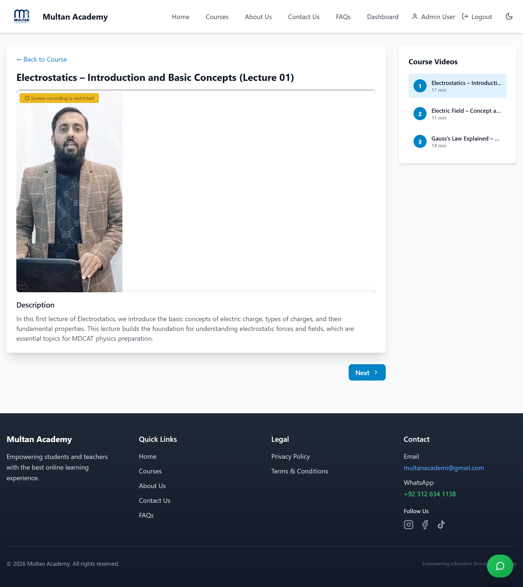

# 🎓Lakshya Academy

> A Production-Ready Full-Stack MERN E-Learning Platform

Multan Academy is a comprehensive online learning management system built using the MERN stack (MongoDB, Express.js, React.js, Node.js).  
It provides a scalable, secure, and feature-rich environment for students, teachers, and administrators.

🌐 Live Website: https:
💻 Tech Stack: MERN + Stripe + Bunny Stream + Cloudinary + JWT Authentication  

---

# 📸 Screenshots

> 📌 Screenshots are located inside the `/screenshots` folder in the root directory.

## 🏠 Landing Page


## 🎓 Student Dashboard


## 🛠 Admin Dashboard


## 📚 Course Detail Page


## 💳 Payment Integration (Stripe)


## 🎬 Course View (Student Perspective)

---

# 🚀 Key Features

## 👤 Authentication & Security
- JWT-based authentication
- Role-based access control (Admin / Student / Teacher)
- Protected routes (Frontend & Backend)
- Secure environment variable configuration
- Video watermark protection
- Device/session management

## 🎓 Course Management
- Create, update, and delete courses
- Categories & Subjects management
- Assignment & Quiz system
- Live classes integration
- Course progress tracking
- Certificate generation

## 🎥 Media & Streaming
- Bunny Stream secure video integration
- Cloudinary media storage
- Protected video player
- Watermark overlay system

## 💳 Payment System
- Stripe integration
- Payment verification & tracking
- Admin payment management dashboard
- Secure checkout workflow

## 📊 Dashboards
- Student dashboard (progress tracking)
- Admin dashboard (full platform control)
- Teacher management system
- Payment & analytics overview

## 📱 UI/UX
- Fully responsive design
- Tailwind CSS styling
- Clean and modern interface
- Optimized for performance

---

# 🛠 Tech Stack

## Frontend
- React.js (Vite)
- Tailwind CSS
- Redux Toolkit
- Axios

## Backend
- Node.js
- Express.js
- MongoDB (Mongoose)
- JWT Authentication

## Integrations
- Stripe API
- Bunny Stream API
- Cloudinary
- Nodemailer (Email Verification)

---

# 📂 Project Architecture

```
multan-academy/
│
├── backend/
│   ├── src/
│   │   ├── config/
│   │   ├── controllers/
│   │   ├── middleware/
│   │   ├── models/
│   │   ├── routes/
│   │   ├── services/
│   │   └── utils/
│   └── package.json
│
├── frontend/
│   ├── src/
│   │   ├── components/
│   │   ├── pages/
│   │   ├── store/
│   │   ├── hooks/
│   │   └── utils/
│   └── package.json
│
└── README.md
```

---

# ⚙️ Installation & Setup

## 1️⃣ Clone Repository

```bash
git clone https://github.com/zohad01/Multan_Academy.git
cd Multan_Academy
```

---

## 2️⃣ Backend Setup

```bash
cd backend
npm install
```

Create a `.env` file inside `/backend` based on `.env.example`:

```env
PORT=5000
MONGO_URI=your_mongodb_uri
JWT_SECRET=your_jwt_secret
STRIPE_SECRET_KEY=your_stripe_secret
BUNNY_STREAM_API_KEY=your_bunny_key
CLOUDINARY_CLOUD_NAME=your_cloud_name
CLOUDINARY_API_KEY=your_cloud_key
CLOUDINARY_API_SECRET=your_cloud_secret
EMAIL_USER=your_email
EMAIL_PASS=your_email_password
```

Run backend:

```bash
npm run dev
```

---

## 3️⃣ Frontend Setup

```bash
cd ../frontend
npm install
npm run dev
```

---

# 🚢 Production Deployment

1. Build frontend:
   ```bash
   cd frontend && npm run build
   ```

2. Deploy:
   - Frontend → Vercel / Netlify
   - Backend → Render / Railway / VPS
   - Database → MongoDB Atlas

3. Set all environment variables in production dashboard.

---

# 🔐 Security Best Practices

- Sensitive keys stored in `.env`
- `.env` excluded using `.gitignore`
- No hardcoded credentials
- Secure payment processing
- Protected video streaming
- Role-based authorization middleware

---

# 📈 What This Project Demonstrates

- Full-stack system architecture
- Secure authentication implementation
- Real-world Stripe payment integration
- Cloud media handling
- Clean REST API design
- Production-ready deployment structure
- Scalable backend organization


---

# 📄 License

Licensed under the MIT License.
